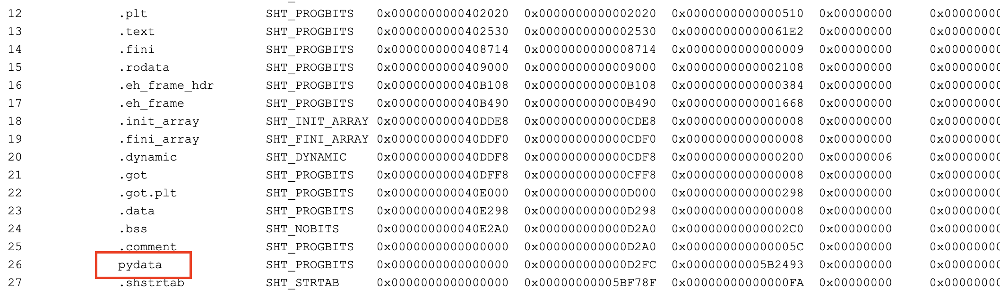
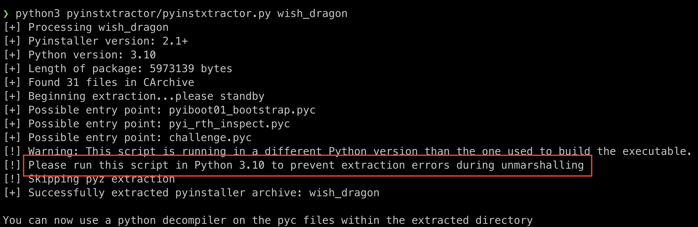
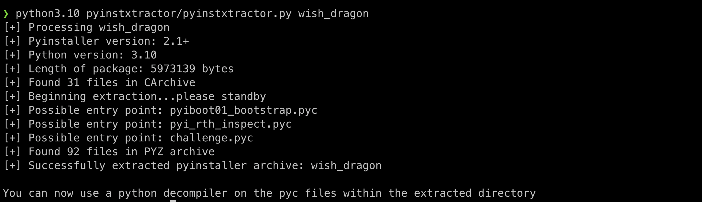
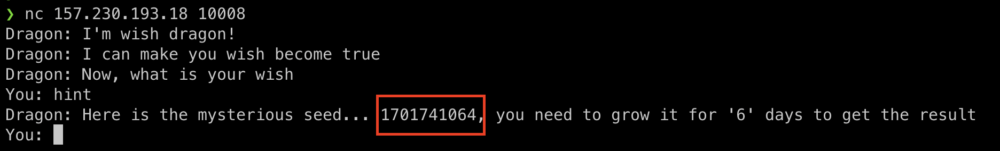
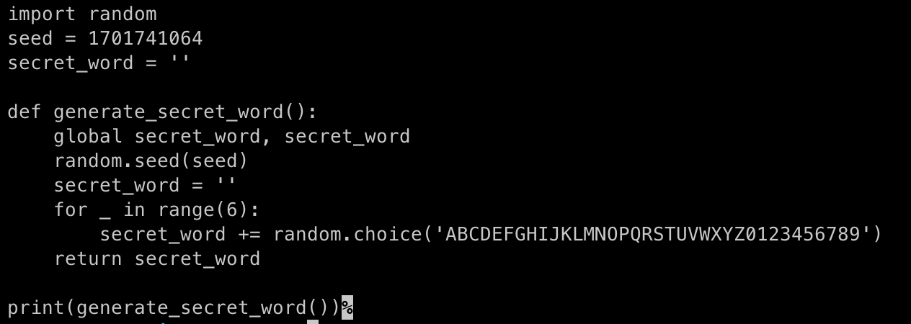
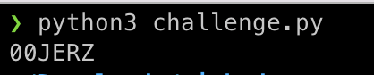
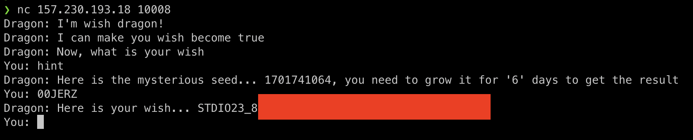

## 08 - Wish Dragon
### Description
In the heart of a bustling city, Jake, a disillusioned architect yearning for a change, stumbles upon an enigmatic artifact at a flea market—a small, intricately carved dragon figurine. To his astonishment, the dragon, named Ember, comes to life, revealing its ability to grant three wishes. Faced with the opportunity to reshape his destiny, Jake wishes for professional success, a flourishing love life, and boundless happiness. However, as Ember weaves its magic, Jake discovers that the true essence of his desires lies not in material gains but in the journey of self-discovery, human connections, and the pursuit of genuine fulfillment. Together, Jake and Ember embark on a transformative quest, unraveling the complexities of desire and the profound impact of choosing wishes that resonate with the soul.

Download: https://stdio-2026-public.2600.in.th/wish_dragon.zip

Author: **Titorps360**

`157.230.193.18:10008`

### Solution
My laptop is arm architecture so I will decompile elf file with online tool. [[Link]](http://www.sunshine2k.de/coding/javascript/onlineelfviewer/onlineelfviewer.html)



Yeah, I found something interesting so I will research about **how to extract pydata from elf**. [[Link]](https://github.com/extremecoders-re/pyinstxtractor)



Dammmm, I need to run on python3.10 so I will do it again on python3.10



Finally, I got extract of wish_dragon, Uncompyle6 and Decompyle++ are the two Python decompilers that I need to use to decompile Python however, from what I've read about these two program, they don't support Python 3.10 so I need to use pycdc to decompile. [[Link]](https://github.com/zrax/pycdc)

#### Install Pycdc
```
git clone https://github.com/zrax/pycdc
cd pycdc
cmake .
make 
make check
sudo mv pycdc /usr/local/bin
```

After Install pycdc, Let's exploit
```
pycdc [folder_of_pyc]/challenge.pyc > challenge.py
```


Now, I know if I type hint the program will return seed, Let's try!!!!



Yummy, I got the seed. 



I bring some code that creates the answer and assigns the newly returned seed from the previous stage. Run program and get the flag XD!!!!





---

“Learning By Doing ,Trial And Error”